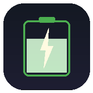
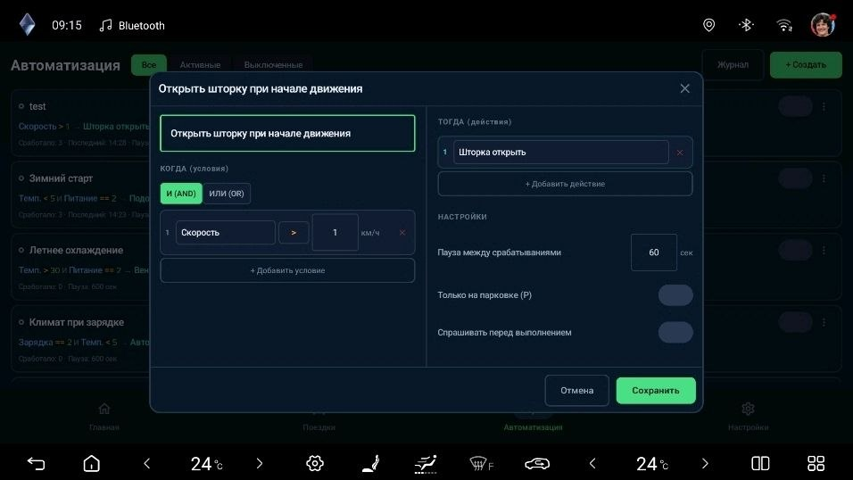
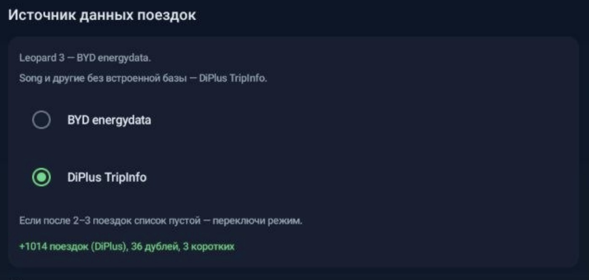

<div align="center">



# BYDMate

### Trip Logger & Energy Analytics for BYD DiLink 5.0

[](https://developer.android.com)
[](https://kotlinlang.org)
[](https://developer.android.com/jetpack/compose)
[](LICENSE)
[](https://github.com/AndyShaman/BYDMate/releases)

**Реальный расход, GPS-маршруты, автоматизация, AI-аналитика — локально, без облака.**

[Возможности](#-возможности) | [Скриншоты](#-скриншоты) | [Автоматизация](#-автоматизация) | [AI Инсайты](#-ai-инсайты) | [Установка](#-установка) | [Сборка](#-сборка-из-исходников)

</div>

---

## Зачем это нужно

Штатный бортовой компьютер BYD **занижает расход на 10-30%**. BYDMate берёт данные напрямую из BMS (energydata) и показывает реальное потребление. Плюс данные, которых нет в штатной системе: расход на стоянке, баланс ячеек, стоимость поездок, AI-аналитика.

Приложение работает **полностью локально** на головном устройстве DiLink 5.0 — никакие данные не покидают автомобиль (кроме опционального AI через OpenRouter).

---

## Возможности

| | Функция | Описание |
|---|---------|----------|
| **BMS** | Реальный расход | Данные BMS (energydata), не бортовой компьютер |
| **GPS** | Трекинг поездок | GPS-маршруты, дистанция, скорость |
| **AI** | AI Инсайты | Анализ вождения через LLM (OpenRouter) |
| **Idle** | Расход на стоянке | Мониторинг idle drain из energydata |
| **Bat** | Здоровье батареи | Температура, баланс ячеек, 12V |
| **Map** | Карта маршрута | osmdroid (OpenStreetMap) в деталях поездки |
| **Rules** | Автоматизация | Правила WHEN→THEN: триггеры по параметрам → команды D+ |
| **Widget** | Плавающий виджет | 7 полей поверх других приложений: SOC, запас хода, расход + тренд, время, t° салона, t° батареи, 12V |
| **Auto** | Автозапуск | WorkManager, запускается при включении |
| **CSV** | Экспорт данных | Экспорт поездок и зарядок в CSV |

---

## Скриншоты

### Dashboard


*SOC, расчётный пробег, статистика за период, AI-инсайт, здоровье батареи, расход на стоянке, последние поездки*

### AI Инсайты (развёрнуто)


*Анализ эффективности вождения от LLM — расход, тренды, батарея, рекомендации*

### Здоровье батареи (развёрнуто)


*Температура, 12V аккумулятор, баланс ячеек, напряжение*

### Поездки


*Аккордеон Месяц > День > Поездка с фильтрами и цветовой индикацией расхода*

### Автоматизация



*Правила КОГДА→ТОГДА, редактор условий и действий, настройки срабатывания*

### Настройки


*Батарея, тарифы, валюта, AI-настройки (OpenRouter API), экспорт данных*

---

## Автоматизация

Вкладка **Автоматизация** позволяет создавать правила для автоматического управления автомобилем через D+ API.

### Принцип работы

**КОГДА** условие выполняется **→ ТОГДА** выполнить команду.

Примеры:
- SOC < 20% → включить внутреннюю циркуляцию
- Скорость > 0 → закрыть шторку
- Температура за бортом < 0 → включить подогрев зеркал

### Возможности

| | Описание |
|---|----------|
| **25 триггеров** | SOC, скорость, температура, двери, окна, давление шин, режим езды, точки-геозоны, время суток и др. |
| **41 команда** | Окна (включая отдельные — водителя и пассажира), климат, свет, замки, люк, зеркала — всё через D+ API |
| **8 видов действий** | D+ команда, тихое/звуковое уведомление, запуск приложения, звонок, навигация, URL, Яндекс.Музыка |
| **Edge trigger** | Срабатывает только при переходе false→true (не повторяется каждые 3 сек) |
| **Cooldown** | Настраиваемая пауза между срабатываниями |
| **Overlay-подтверждение** | Всплывающее окно «Отмена / Выполнить» перед действием. Таймаут 15 с → автоотмена |
| **Безопасность** | Окна не открываются на скорости > 80 км/ч, CAN/SHELL команды заблокированы |
| **Журнал** | Лог всех срабатываний с результатами |
| **Шаблоны** | 6 готовых правил для быстрого старта |

### Логика

- **AND** — все условия должны выполняться
- **OR** — достаточно одного условия
- **Только на P** — правило срабатывает только когда авто на паркинге

---

## Плавающий виджет

Компактный overlay 260×108 dp поверх других приложений — видно на карте, в медиа, в BYD-приложениях.

### Что показано

Семь полей в 3 строки. Цвета: иконки серые, значения белые. Рамка и SOC% подсвечиваются цветом статуса (SOC или 12V — что хуже).

**Верхняя строка** (мелким, 13sp):
- ⏱ **Длительность текущей поездки** — `N мин` или `X ч Y мин` (напр. `47 мин`, `1 ч 12 мин`). Старт — момент включения зажигания, конец — выключение. Простои с включённой машиной (стоишь с кондиционером, пассажир вышел купить воды, светофор) входят в поездку — пока электрика жива, счётчик не сбрасывается
- 🚗 **Температура в салоне** — °C, с DiPlus

**Центральная строка** (крупно, главные значения):
- **SOC %** (18sp bold, цветной) — заряд тяговой батареи. Зелёный > 50%, жёлтый 20–50%, красный < 20%
- **~N км** (28sp белым) — расчётный запас хода: `SOC × ёмкость батареи ÷ baseline-расход × 100`. Тильда подчёркивает что это оценка, не показания БК
- **X.X ↓** (18sp, цветной по тренду) — **расход за последние 5 км**, кВт·ч/100км, со стрелкой тренда (см. ниже)

**Нижняя строка** (мелким, 13sp):
- 🔋 **Температура батареи** — °C, с DiPlus
- ⚡ **12V** — напряжение бортовой сети, В. Норма 12.5–14.7 В, < 12.0 В = жёлтый, < 11.7 В = красный

### Расход и стрелка тренда (правый блок центральной строки)

**Цифра справа от пробега (X.X)** — **расход за последние 5 км** в кВт·ч/100км. Не «средний за всю поездку», а «как ты едешь прямо сейчас».

**Зачем она такая.** Слева виджет показывает запас хода `~180 км` — он считается от средней по истории (baseline). Но прямо сейчас ты можешь ехать не так, как обычно: гонишь по трассе — расход 22, плетёшься по пробкам — 14. Цифра расхода в правом углу нужна, чтобы это увидеть и мысленно поправить `~180 км` в голове: если rolling 22 при baseline 18, реально ты проедешь не 180, а `180 × 18 / 22 ≈ 158 км`. Поэтому важно, чтобы цифра отражала **текущий стиль**, а не замыленный средний с утра — отсюда окно 5 км по пробегу, а не «всё с начала поездки».

**Что такое «поездка» для этой цифры.** Сессия = один ignition-цикл: включил зажигание → выключил. Стоянка с включённым кондиционером внутри сессии учитывается естественно (лишние кВт·ч попадают в общий знаменатель). Короткие блипы питания (светофор, bluetooth-переподключение) не раскалывают поездку на две. Если DiLink прибьёт приложение посреди 30-км трассы, якорь сессии сохранён в SharedPreferences — после рестарта счёт продолжается с реального момента включения зажигания, а не с нуля.

Значение зависит от стадии поездки:

| Состояние | Что показано | Почему так |
|-----------|--------------|------------|
| Поездка не идёт (ignition OFF) | **baseline** (EMA истории) — без стрелки | Машина стоит — показываем ambient значение |
| Пробег < 500 м | **`—`** (прочерк) | Холодный старт, разгон с места дают 60–100 кВт·ч/100 — визуальный шум, цифре доверять нельзя |
| 500 м ≤ пробег < 5 км | **средний с начала поездки** (cumulative) | В окне 5 км данных ещё не накопилось — временно показываем средний всей сессии |
| Пробег ≥ 5 км | **rolling 5 км** | Окно заполнилось — цифра отражает только последний участок, а не разгон в начале |
| Пробег ≥ 2 км | **+ стрелка тренда** | Начиная с 2 км добавляется сравнение с обычным стилем (см. ниже) |

Пример: проехал 10 км по городу с расходом 14, потом выехал на трассу и 5 км шёл под 22. Cumulative-логика показала бы `(10×14 + 5×22) / 15 ≈ 16.7` — усреднено, «всё нормально». Rolling 5 км покажет `22` — честно отразит текущий стиль.

**Стрелка тренда** сравнивает rolling-цифру с твоим обычным стилем:

- **↓ зелёная** — едешь экономнее обычного
- **→ серая** — в пределах обычного
- **↑ жёлтая** — расход выше обычного

Baseline для сравнения — **EMA последних 10 поездок** длиной от 1 км (парковочные манёвры отсекаются), коэффициент сглаживания 0.3. Не привязан к календарной неделе: отражает твой актуальный стиль, а не то, как ты ездил в прошлое воскресенье — поэтому зимой стрелка не торчит вверх к прошлогоднему лету. Гистерезис 0.95 / 1.05 на вход, 0.97 / 1.03 на выход + debounce 60 сек — стрелка не дёргается от одной остановки на светофоре.

### Управление

- **Обычный тап** — открыть BYDMate
- **Долгий тап (1.5 сек)** — скрыть до следующего открытия BYDMate
- **Перетащить в корзину** — выключить совсем
- Включение, прозрачность, сброс позиции — в **Настройки → Плавающий виджет**

---

## Источник данных поездок

BYDMate поддерживает две модели поставки данных — переключается в **Настройки → Источник данных поездок** или на шаге мастера первого запуска.



| Режим | Для каких машин | Что читается |
|-------|-----------------|--------------|
| **BYD energydata** | Leopard 3 (Fangchengbao Bao 3) и другие модели со встроенной BMS-базой `energydata` | SQLite BYD: точный расход (BMS), пробег, длительность, заряды |
| **DiPlus TripInfo** | Song и другие модели **без** встроенной energydata | База DiPlus: список поездок, SOC start/end, средняя скорость |

**Как выбрать:** если после 2–3 поездок на машине список «Поездки» пустой — переключите режим. На Leopard 3 нужен energydata (точнее), на Song и аналогах — TripInfo (единственный доступный источник).

В режиме `DiPlus TripInfo` расход считается по разнице SOC — он на ~1 кВт·ч/100км грубее, чем BMS, но это компенсируется тем, что других данных у машины нет.

---

## Целевое устройство

| Параметр | Значение |
|----------|----------|
| Платформа | DiLink 5.0 (Android 12, API 32) |
| Процессор | Snapdragon 780G |
| Экран | 15.6" landscape, 1920x1200 |
| GMS | Нет (AOSP без Google Play Services) |
| Протестировано | BYD Leopard 3 (Fangchengbao Bao 3) |

---

## Как работает

```
BYD energydata (BMS SQLite)  →  HistoryImporter    →  Room DB  →  Compose UI
DiPlus API (localhost:8988)  →  TrackingService     ↗     ↓
Android LocationManager     →  TripTracker (GPS)    ↗   AI (OpenRouter)
DiPlus sendCmd API           ←  AutomationEngine   ←  Rules (Room DB)
```

| Данные | Источник |
|--------|----------|
| Расход, пробег, длительность | BYD energydata (BMS) |
| SOC, скорость, температура | DiPlus API (`getDiPars`) |
| Напряжение ячеек, 12V | DiPlus API |
| GPS координаты | Android LocationManager |
| AI-аналитика | OpenRouter API (опционально) |
| Управление авто | DiPlus sendCmd API (автоматизация) |

**Без OBD-адаптера** — BYD блокирует сторонние OBD-устройства. BYDMate использует тот же API, что и встроенные приложения BYD.

---

## Установка

### 1. Активация ADB (опционально)

ADB нужен, только если вы хотите устанавливать APK через `adb install` или дёргать систему командами. **Для обычной установки D+ и BYDMate ADB не требуется** — достаточно файлового менеджера или флешки (см. шаг 2).

- **DiLink 3 / 4** — можно включить самостоятельно: установите [BydDevelopmentTools](https://disk.yandex.by/d/e3gEnY9P2Y9_fQ), зайдите в *Настройки → Version Management*, 10 раз тапните по тексту *Reset to factory default*, активируйте *Debug Mode when USB is Connected* и *Wireless adb debug switch*. На обновлённых прошивках DiLink 3/4 ADB может быть так же закрыт, как на DiLink 5 — тогда придётся идти по пути ниже.
- **DiLink 5.0** — ADB-отладка **заблокирована** и открывается только удалённо из Китая. Сделать это можно через продавцов на **TaoBao** (поиск по `DiLink 5.0`, ~40 ¥ внутри Китая / ~80 ¥ извне, оплата через AliPay). Продавец удалённо открывает инженерное меню по присланному QR-коду, после чего ADB включается штатно.

  Пошаговая инструкция: [PDF-гайд (русский)](docs/guides/dilink5-adb-activation-ru.pdf) — приложен в репозитории.

### 2. Установка DiPlus (D+)

На головном устройстве должен быть установлен **[DiPlus (D+)](https://drive.google.com/file/d/1ndKgzh-HWRPrPw2eTbKh9pwhdDwYJ0Ug/view?usp=drive_link)** — приложение-мост для доступа к данным автомобиля.

Самый простой способ (без ADB):

1. Скачайте APK по ссылке выше
2. Перенесите на USB-флешку (или скачайте напрямую через браузер DiLink)
3. Откройте файл через файловый менеджер DiLink и установите
4. Разрешите установку из неизвестных источников, если потребуется

Альтернативно через ADB (если активирован на шаге 1):

```bash
adb connect <IP-адрес DiLink>:5555
adb install DiPlus.apk
```

IP-адрес DiLink можно найти в настройках Wi-Fi на головном устройстве.

### 3. Установка BYDMate

1. Скачайте BYDMate APK из [**Releases**](https://github.com/AndyShaman/BYDMate/releases)
2. Перенесите на DiLink: через USB-флешку, по сети, или через ADB (`adb install BYDMate.apk`)
3. Разрешите установку из неизвестных источников, если потребуется

### 4. Первый запуск

1. Откройте BYDMate — появится мастер настройки
2. Выдайте разрешения на **локацию** и **хранилище** (для GPS и чтения energydata)
3. Выберите **источник данных поездок** — `BYD energydata` для Leopard 3, `DiPlus TripInfo` для Song и других моделей без встроенной BMS-базы (см. [секцию выше](#источник-данных-поездок))
4. Укажите **тарифы** на электроэнергию (для расчёта стоимости поездок)

### 5. Фоновая работа

**Важно:** отключите "Disable background Apps" для BYDMate, иначе DiLink будет убивать приложение:


*DiLink > Settings > General > Disable background Apps > BYDMate = **OFF***

### 6. Настройка (опционально)

В **Настройках** можно изменить:
- **Ёмкость батареи** — по умолчанию 72.9 кВт·ч (Leopard 3)
- **Тарифы** — домашний (AC) и быстрая зарядка (DC), валюта
- **Пороги расхода** — границы для цветовой индикации (зелёный/жёлтый/красный)

---

## AI Инсайты

BYDMate может анализировать вашу статистику вождения с помощью AI (LLM). Это опциональная функция — приложение полностью работает и без неё.

### Настройка

1. Зарегистрируйтесь на [OpenRouter](https://openrouter.ai/) (бесплатно)
2. В личном кабинете OpenRouter создайте **API Key** (раздел Keys)
3. В BYDMate откройте **Настройки** → раздел **AI Инсайты**
4. Вставьте API-ключ в поле "OpenRouter API Key"
5. Нажмите **"Выбрать модель"** — откроется список доступных LLM (есть бесплатные)
6. Нажмите **"Сохранить и получить инсайт"**

### Что анализирует

AI получает обезличенную статистику за 7 и 30 дней и возвращает:

- **Факты** — метрики, рассчитанные из реальных данных (расход с трендом, % коротких поездок, idle drain)
- **Инсайты** — корреляции, аномалии и поведенческие рекомендации от LLM

Запрос отправляется **раз в день**. Результат кэшируется локально. Никакие персональные данные (GPS, маршруты) не передаются — только агрегированная статистика.

---

## Сборка из исходников

```bash
# Требуется: JDK 17, Android SDK 34
git clone https://github.com/AndyShaman/BYDMate.git
cd BYDMate
./gradlew assembleDebug
```

---

## Стек технологий

- **Kotlin** 2.1 + **Jetpack Compose** + Material 3
- **Room** (SQLite) + **Hilt** (DI) + **OkHttp**
- **osmdroid** (OpenStreetMap) + **Coroutines/Flow**
- Min SDK 29 / Target SDK 29 / Compile SDK 34

---

## Благодарности

- **[BYD Trip Info](https://www.byd-seal-forum.de/forum/thread/1811-byd-trip-info-app/)** (`org.jayb.bydapp`) by jayb — оригинальное приложение для DiLink, вдохновение для BYDMate
- **[DiPlus](https://www.dilink.cn/)** (迪加) by Van Design — приложение-мост к данным автомобиля

---

## Лицензия

**GPLv3** с дополнительными условиями атрибуции.
См. [LICENSE](LICENSE) для деталей.

Copyright (C) 2026 [AndyShaman](https://github.com/AndyShaman)

---

<details>
<summary><b>English version</b></summary>

## What is BYDMate?

BYDMate is an Android app for BYD vehicles with DiLink 5.0 head unit (Leopard 3 / Fangchengbao Bao 3). It logs trips, GPS routes, real energy consumption from BMS, and provides AI-powered driving analytics — all locally on the head unit.

### Why?

The BYD onboard computer **underestimates consumption by 10-30%**. BYDMate reads real consumption data from the BMS (energydata SQLite database) and shows information not available in the stock system: idle drain, cell balance, trip costs, AI driving insights.

### Features

- **Real consumption** from BMS energydata (not onboard estimates)
- **Trip logging** with GPS routes, distance, speed
- **AI Insights** — LLM-powered driving analysis via OpenRouter (optional)
- **Idle drain** monitoring from BMS data
- **Battery health** — temperature, cell balance, 12V voltage
- **Trip map** with speed-colored routes (osmdroid, no Google Maps)
- **Automation** — WHEN→THEN rules: triggers on 25 parameters → 41 D+ commands (windows incl. driver/passenger, climate, lights, locks, mirrors) + 8 action kinds (notification, app launch, call, navigate, URL, Yandex Music). Overlay confirmation with 15 s auto-cancel
- **Floating widget** — draggable 7-field overlay: SOC, range, rolling-5 km consumption + trend arrow vs your 10-trip baseline, ignition-bounded trip time, cabin/battery temp, 12V. Session survives app kill via SharedPreferences anchor
- **Auto-start** via WorkManager on boot
- **CSV export** for trips and charges

### How it works

BYDMate reads vehicle data from two sources:
- **BYD energydata** (built-in BMS SQLite database) — accurate per-trip consumption
- **DiPlus** app's local API (`localhost:8988`) — live SOC, speed, temperatures, cell voltages

No OBD adapter needed. No cloud/server — everything stays on the head unit (except optional AI via OpenRouter).

### Trip data source (Leopard 3 vs Song)

BYDMate supports two trip data backends, switchable in **Settings → Trip data source** or during the first-run wizard:

- **BYD energydata** — for Leopard 3 (Fangchengbao Bao 3) and other models that ship the built-in BMS database. Most accurate per-trip consumption.
- **DiPlus TripInfo** — for Song and other models **without** built-in energydata. Reads trips from DiPlus database; consumption is computed from SOC delta (~1 kWh/100km coarser than BMS).

If the Trips list stays empty after 2–3 drives, switch the mode.

### Installation

1. *(Optional)* Enable ADB on your head unit. Not required for installing D+ or BYDMate — only needed if you want to push APKs via `adb install`. On DiLink 3/4 you can enable it yourself; on **DiLink 5.0** ADB is locked and must be unlocked remotely from China via TaoBao sellers (~40–80 ¥). See [PDF guide (RU)](docs/guides/dilink5-adb-activation-ru.pdf) included in the repo.
2. Install **[DiPlus (D+)](https://drive.google.com/file/d/1ndKgzh-HWRPrPw2eTbKh9pwhdDwYJ0Ug/view?usp=drive_link)** on your DiLink head unit — copy the APK via USB stick and open it in the file manager (no ADB needed).
3. Download BYDMate APK from [Releases](https://github.com/AndyShaman/BYDMate/releases)
4. Transfer to DiLink via USB and install
5. Grant location + storage permissions
6. Disable "Disable background Apps" for BYDMate in DiLink Settings

### AI Insights

1. Get an API key from [OpenRouter](https://openrouter.ai/) (free models available)
2. Enter the key in BYDMate Settings and select a model
3. Click "Save and get insight"

AI analyzes 7-day and 30-day driving stats. Key metrics (consumption trends, short trips ratio, idle drain) are calculated deterministically. LLM provides correlations, anomalies, and behavioral advice in Russian.

### Building

```bash
# Requirements: JDK 17, Android SDK 34
git clone https://github.com/AndyShaman/BYDMate.git
cd BYDMate
./gradlew assembleDebug
```

### Credits

- **[BYD Trip Info](https://www.byd-seal-forum.de/forum/thread/1811-byd-trip-info-app/)** by jayb — original DiLink trip app, inspiration for BYDMate
- **[DiPlus](https://www.dilink.cn/)** by Van Design — local vehicle data API bridge

### License

GPLv3 with attribution. See [LICENSE](LICENSE).

</details>
